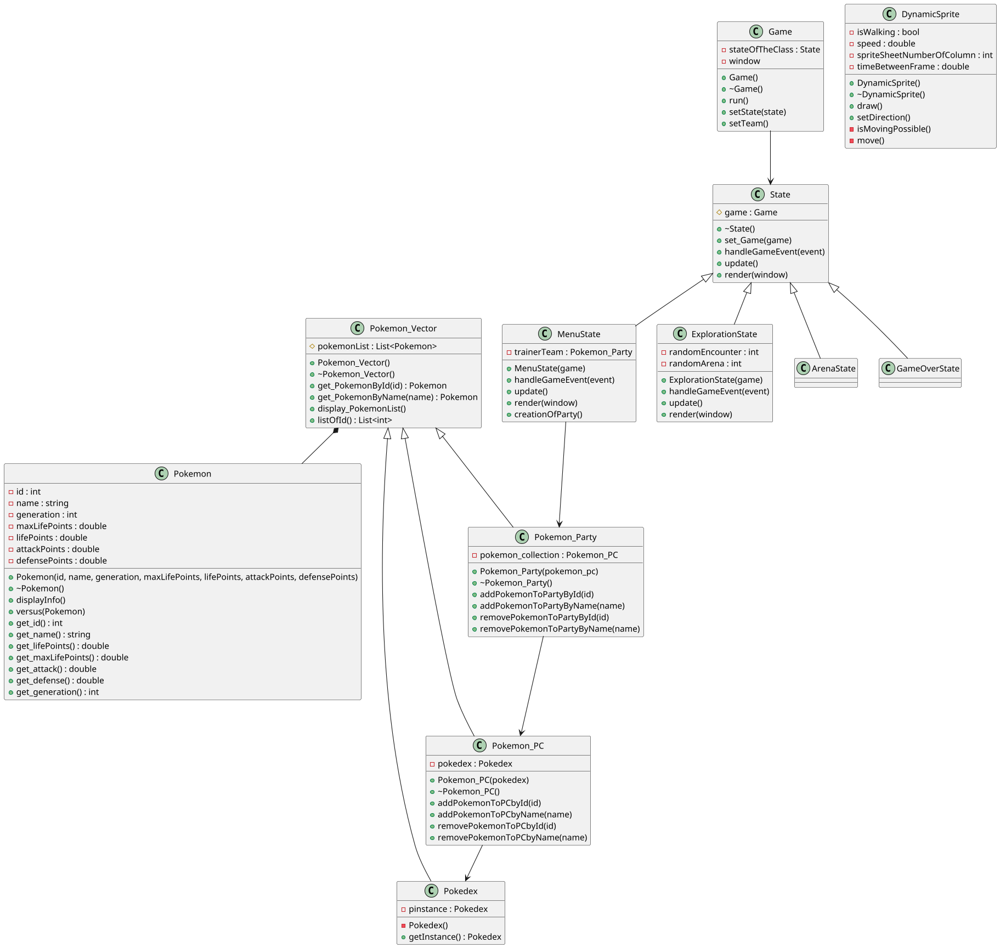

# TP Pokemon Selector
> Fait par Pressard Clovis

## TP du 10 Septembre

###  Avancé en TP
La création de la classe Pokemon a été fait.
La classe Pokemon Vector est en cours de realisation.
Les fichiers des autres classes ont été créer mais sont 
vides pour l'instant.

###  Avancé en dehors du TP
La classe Pokemon a été mis à jour avec l'amélioration de
la méthode versu. De plus la class Pokemon_Vector a été mis
en place ne laissant normalement que les classes filles à 
faire. Aussi la complétion du fichier Pokedex et Pokemon_PC.
Ne laissant plus que le fichier Pokemon_Team à terminer.

## TP du 19 Septembre

###  Avancé en TP
La continuité du Pokemon_Team ainsi que la review ainsi que 
l'ajout d'une fonction au sein de la Review.

###  Avancé en dehors du TP
Le pokemon Team a été finalisé. Ne laissant que le travail 
de la dernière séance à être réalisé.

## TP du 19 Septembre

###  Avancé en TP

## Compréhension du TP

### Classe Pokemon
C'est la classe qui initialise et garde les infos sur les 
Pokemon, definissant leur nom, leur attack, ...

### Classe Pokemon Vector
C'est la clase mère qui définie une liste par rapport à la classe 
Pokemon. 

### Classe Pokedex
C'est la classe fille, cette dernière utilise le Patern Design Singleton,
l'objectif est de s'assurer d'une création unique de cette classe.
Dans cet class on souhaite y stocké tout les pokemon existant.

### Classe Pokemon Party renomé Pokemon PC
C'est la classe fille, elle a pour but de stocker les pokemons appartenant,
au joueur dans un stockage, ces derniers ne sont utilisables en combats
si et seulement si intégré dans l'équipe de pokemon

### Classe Pokemon Attack renomé Pokemon Party
C'est la classe fille, cet dernière contient les pokemons utilisé pour les 
combats.

## Diagramme de Class UML

